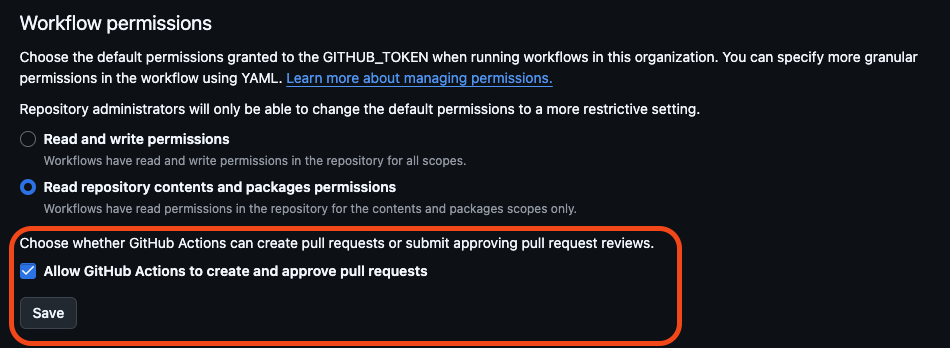

# Code to Cloud AWS Workshop

## GitHub Setup 1 of 2

1. [Create a GitHub Organization](https://docs.github.com/en/organizations/collaborating-with-groups-in-organizations/creating-a-new-organization-from-scratch)
2. Allow GitHub Actions in Organization to open PR's
    - Click on your new Organization Name
    - Settings (top nav)
    - Actions -> General (left nav)
    - Scroll to bottom of page, select: "Allow GitHub Actions to create and approve pull requests"
    - Click "Save"

    

3. [Create a Classic PAT](https://docs.github.com/en/authentication/keeping-your-account-and-data-secure/managing-your-personal-access-tokens#creating-a-personal-access-token-classic) with the following values, and save the generated token:
    - repo (all values)
    - workflow
    - read:public_key
    - read:repo_hook
    - notifications
4. Clone this repo into your new organization
    - Use this template -> create a new repository

## Terraform Cloud Setup 1 of 1

1. Create a new workspace in your organization
    - Organization -> Workspaces -> New (Workspace)
2. Create a variable set in your TFC organization
    - Organization -> Settings -> Variable sets -> Create variable set
    - Name the variable set (Prisma Cloud Lab, etc.)
3. Create the following variables in the set

    > | Name |  Type  | Sensitive | Value |
    > |------|--------|-----------|-------|
    > | AWS_ACCESS_KEY_ID | Environment variable | false | AWS Access key
    > | AWS_SECRET_ACCESS_KEY | Environment variable | true | AWS Access key secret
    > | TF_VAR_git_token | Terraform variable | true | GitHub PAT value from above

## GitHub Setup 2 of 2

1. Create the following secrets in your GitHub repository
    - Navigate to your repo
    - Settings (top nav)
    - Secrets and variables -> Actions (side nav)
    - New respository secret
    - Repeat until all values have been added

### Required Repository Secrets

 | Secret |  Type  | Description |
 |--------|---------|-------------|
| AWS_ACCESS_KEY_ID | `string` | AWS IAM access key with the ability to create and provision infrastructure
| AWS_SECRET_ACCESS_KEY | `string` | Password/secret key for IAM access key
| PC_CONSOLE | `string` | Runtime console path (Runtime -> Manage -> System -> Utilities )
| PC_KEY | `string` | Access key with permissions to install Defender (Settings -> Access Control -> Access Keys)
| PC_SECRET | `string` | Generated secret access key used for authentication
| TF_API_TOKEN | `string` | API token used for GitHub -> Terraform Cloud integration (Terraform Cloud -> User Drop-Down -> Account Settings -> Tokens)
| TF_CLOUD_ORGANIZATION | `string` | Name of your created Terraform Cloud Organization
| TF_WORKSPACE | `string` | Name of your created Terraform Cloud Workspace
| TF_WORKSPACE_ID | `string` | Generated ID of your Terraform Cloud Workspace

---

## SSH to EC2 Instance

Connect to Secrets Manager and save private key to local file.

1. Set Region 
    ```Shell
    awsRegion="us-east-1"
    ```

2. Set instance IP
    ```Shell
    instanceIP="1.1.1.1"
    ```

3. Pull SSH key from AWS Secrets Manager
    ```Shell
    aws secretsmanager get-secret-value --secret-id ssh_private_key-$awsRegion --query SecretString --output text --region $awsRegion > $awsRegion.pem
    ```


4. Modify key permissions
    ```Shell
    chmod 400 $awsRegion.pem 
    ```


5. Connect to EC2 instance
    ```Shell
    ssh -i $awsRegion.pem ec2-user@$instanceIP
    ```


## Update Kubeconfig

Running this command will allow you to execute kubectl commands against the K8s cluster deployed. 

> [!NOTE]
> You will need to add your SSO accont to the access permissions of the EKS cluster. The following Access policies need to be assigned"
>   - AmazonEKSAdminPolicy
>   - AmazonEKSClusterAdminPolicy

---

1. Set Region 
    ```Shell
    awsRegion="us-east-1"
    ```
    
2. Update kubeconfig
    ```Shell
    aws eks update-kubeconfig --region $awsRegion --name code2cloud
    ```

## Install K8s Defender Helm Chart

Follow these steps to install the K8s Defender. 


1. Set Region and Defender Helm Chart Location
    ```Shell
    awsRegion="us-east-1"
    helmChart="~/Downloads/twistlock-defender-helm.tar.gz"
    ```
    
2. Create Twistlock Namespace
    ```Shell
    kubectl create namespace twistlock
    ```


3. Install Defender Helm Chart
    ```Shell
    helm upgrade --install twistlock-defender-ds --namespace twistlock --recreate-pods $helmChart
    ```
